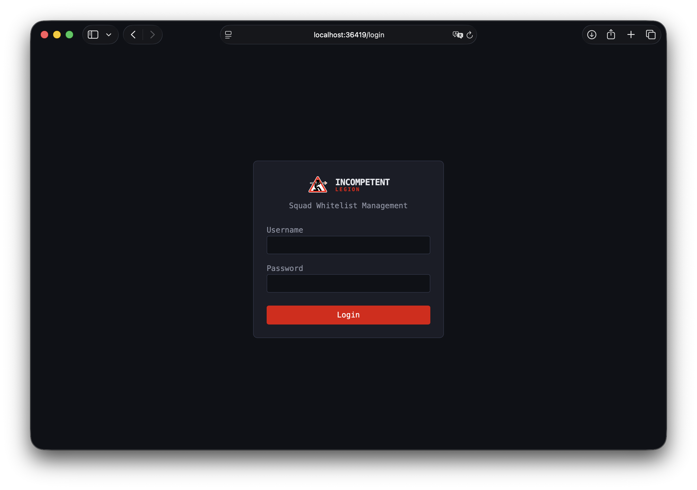
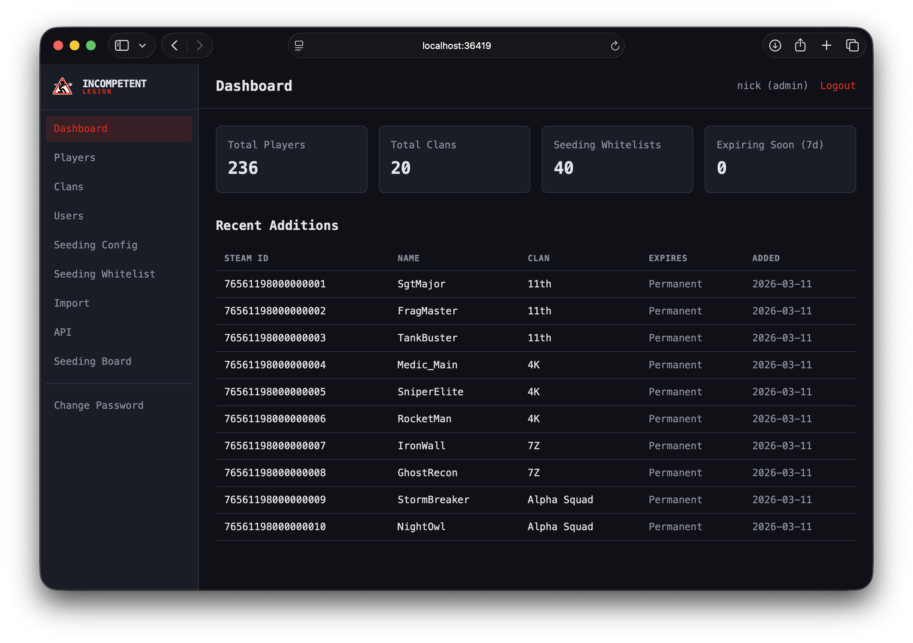
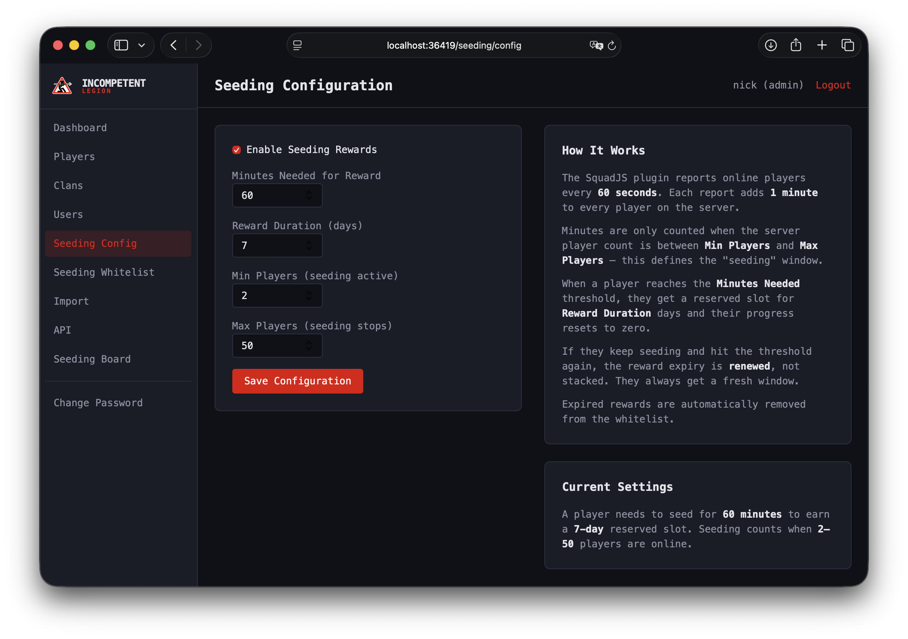
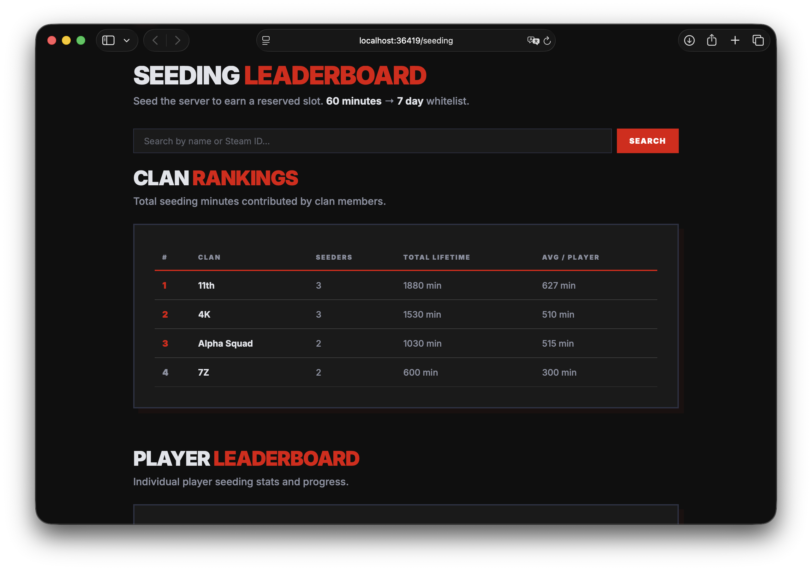
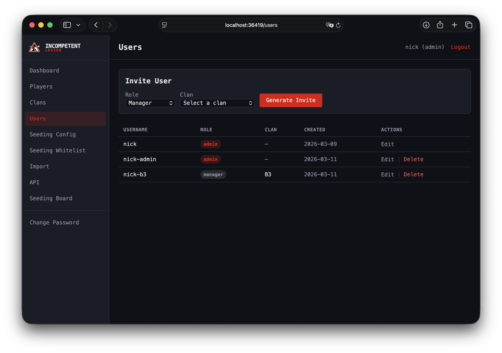
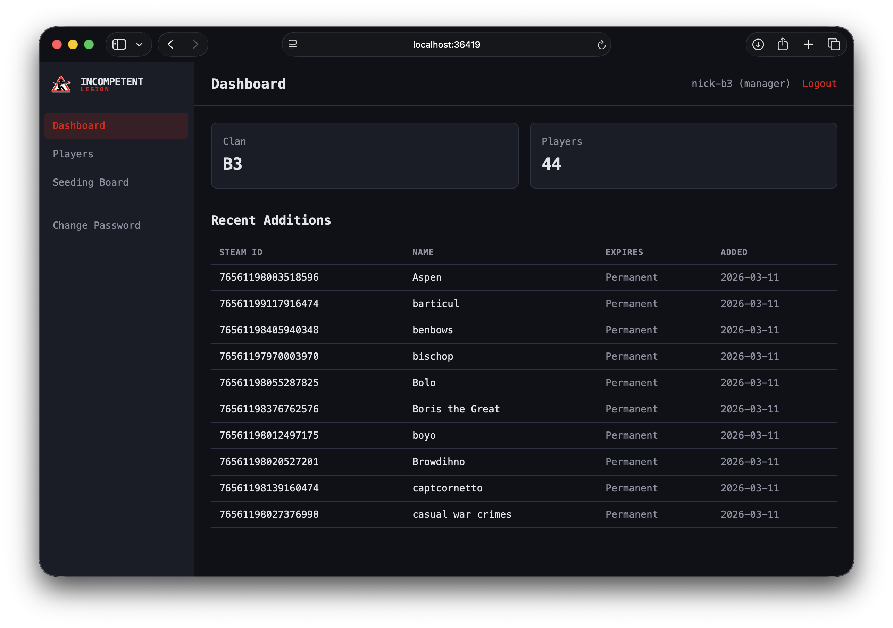
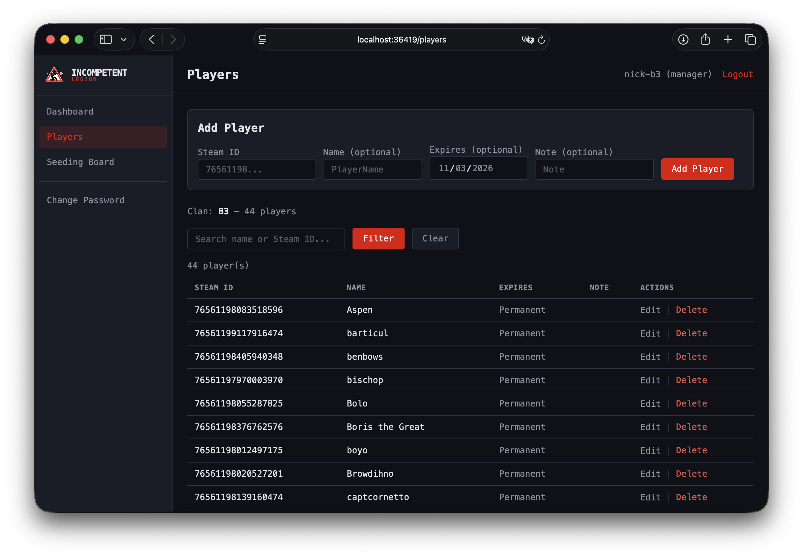

# Squad Whitelist Manager

Web-based whitelist manager for Squad game servers. Manage clans, players, and reserved slots through a clean admin panel. Includes a seeding reward system that automatically grants whitelist slots to players who help seed the server.

## Features

- **Clan management** — create clans with tags and player limits, assign managers
- **Player whitelist** — add/remove players by Steam ID, set expiry dates, filter by clan
- **Role-based access** — admins manage everything, clan managers manage their own roster
- **Seeding rewards** — players earn whitelist slots by seeding (via SquadJS plugin)
- **Public leaderboard** — shows seeding progress, lifetime stats, reward status, and clan rankings
- **Whitelist output** — serves a plain-text whitelist file at `/whitelist` for your Squad server to consume
- **API management** — configure API keys and view endpoint docs from the admin panel

## Screenshots

<p>
  
  
  
  
  
  
  
</p>

## Setup

```bash
npm install
npm start
```

The server runs on port `36419` by default (override with `PORT` env var).

On first visit you'll be prompted to create an admin account.

### Docker

```bash
docker compose up -d
```

Database is persisted in a named volume. Override the port or other settings with env vars in `docker-compose.yml`:

```yaml
environment:
  - PORT=36419
```

## Configuration

| Env var | Default | Description |
|---------|---------|-------------|
| `PORT` | `36419` | Server port |
| `DB_PATH` | `./whitelist.db` | Path to the SQLite database file |
| `NODE_ENV` | _(none)_ | Set to `production` to enable secure cookies (HTTPS) |

### Database location

By default the database file is stored in the project root. Override with the `DB_PATH` env var to place it wherever you want:

```bash
DB_PATH=./data/whitelist.db npm start
```

## API & Keys

All API keys are managed from the admin panel under **API**. The page also shows full endpoint documentation with ready-to-copy URLs.

### Endpoints

**Whitelist Output** — `GET /whitelist`

Returns a plain-text whitelist in Squad `RemoteAdminListHosts` format. Point your server's `RemoteAdminListHosts` to:

```
http://your-host:36419/whitelist
```

By default the endpoint is public. To protect it, set a whitelist key on the **API** page — the URL becomes `/whitelist/<key>`.

**Seeding Report** — `POST /seeding/report/<seeding-key>`

SquadJS plugin sends player data to this endpoint every 60 seconds. Request body:

```json
{ "players": [{ "steamId": "765...", "name": "PlayerName" }] }
```

**Seeding Progress** — `GET /seeding/progress/<seeding-key>/<steam-id>`

Returns a player's current seeding progress and reward status.

## Seeding Rewards

The seeding system tracks how long players help seed the server and automatically grants temporary whitelist slots when they hit a configurable threshold.

1. Install the SquadJS plugin from `squadjs-plugin/whitelist-seeding.js`
2. Configure the plugin with your server's URL and seeding API key (both found on the **API** page)
3. Configure thresholds and reward duration in the admin panel under **Seeding Config**

## Tech Stack

- Node.js + Express
- EJS templates
- sql.js (pure JS SQLite — no native compilation needed)
- bcryptjs for password hashing
